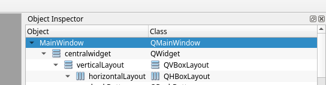

# pyqt-language-detecter


Main windows layout setzten (dann is es auch responsive):



linksclick auf MainWindow -> Lay out -> das gewünschte Layout wählen


Konvertieren:

```
pyuic5 main_windows.ui -o main_window.py
```

Run:

```
venv/bin/python RESTServer.py & venv/bin/python Client.py
```
